# System Architecture

This document provides a comprehensive overview of CropSchool's system architecture, including component relationships, data flow, and technical decisions.

## 🏗️ High-Level Architecture

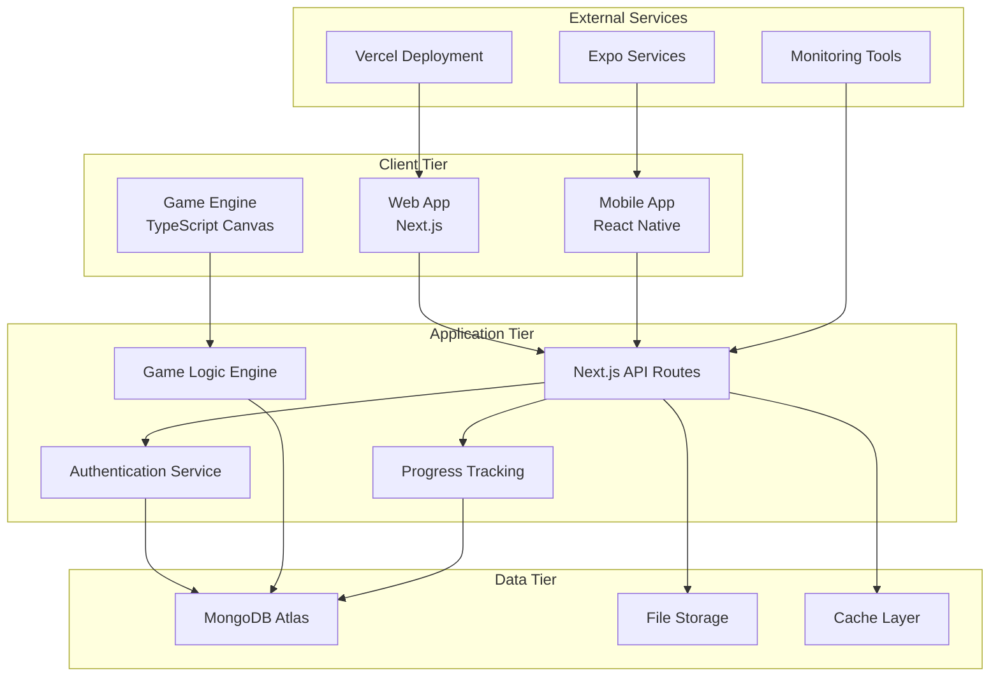

## 📦 Monorepo Structure

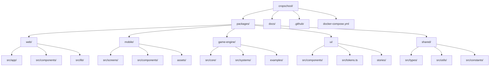

## 🔄 Data Flow Architecture

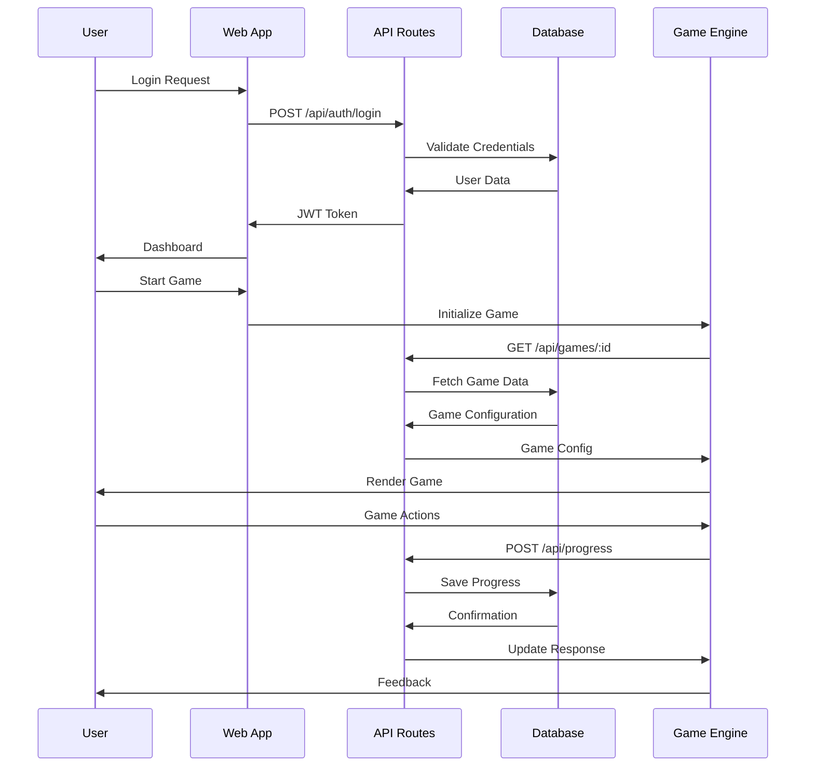

## 🎯 Component Architecture

### Web Application (Next.js)

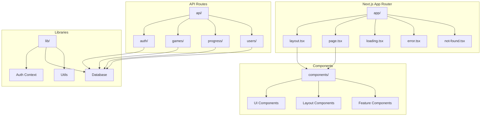

### Game Engine Architecture

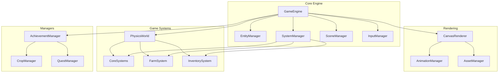

### Mobile App Architecture

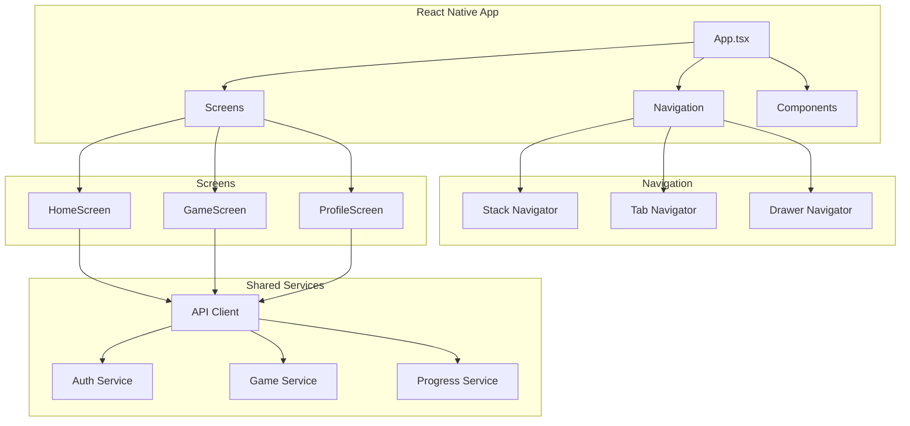

## 🗄️ Database Architecture

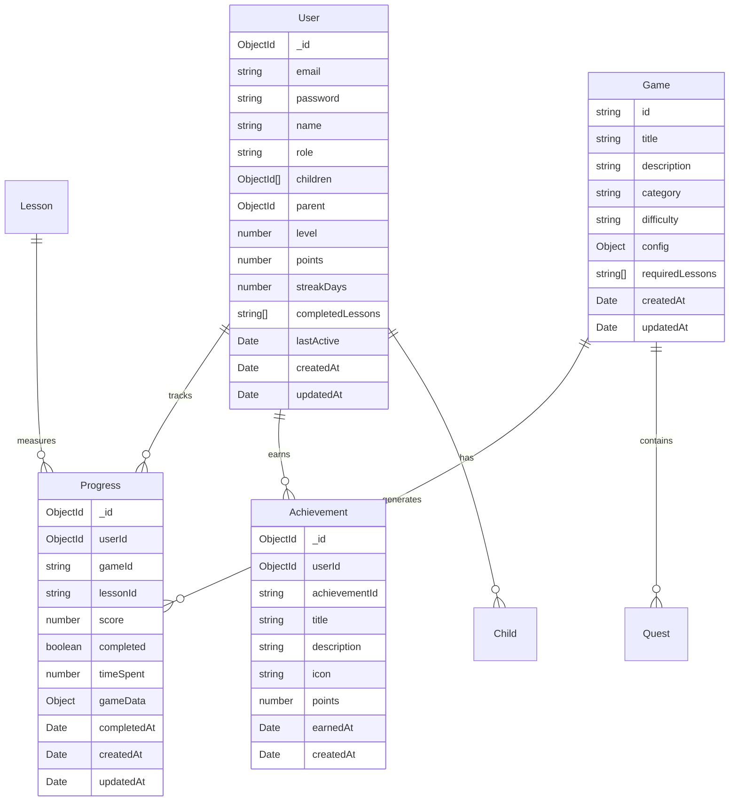

## 🔐 Authentication Architecture

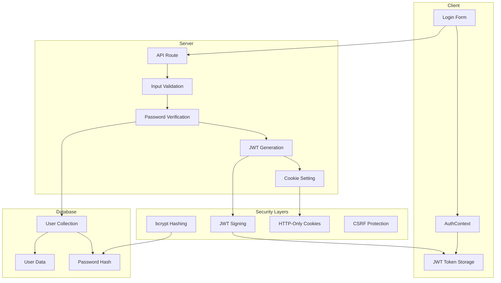

## 🎮 Game Integration Architecture

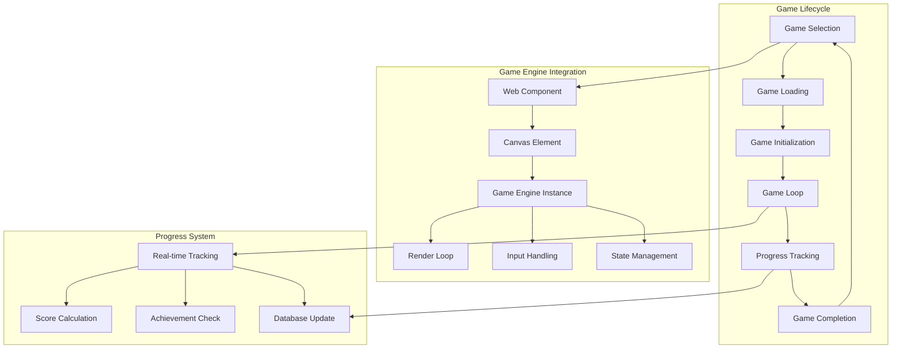

## 🔧 Development Architecture

### Build System

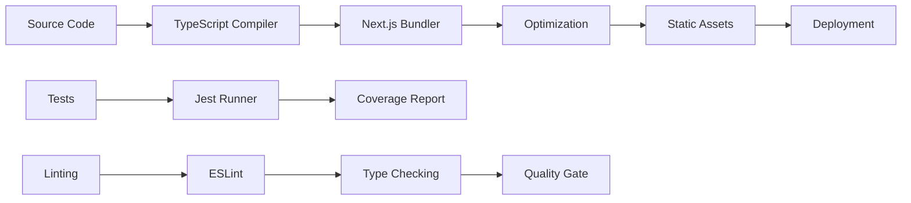

### CI/CD Pipeline

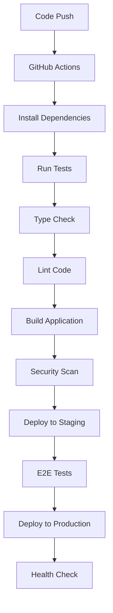

## 📊 Performance Architecture

### Caching Strategy

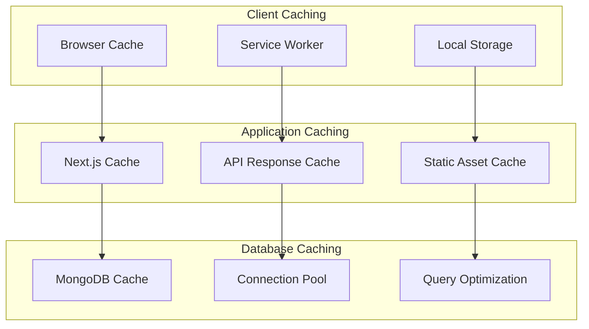

### Load Balancing

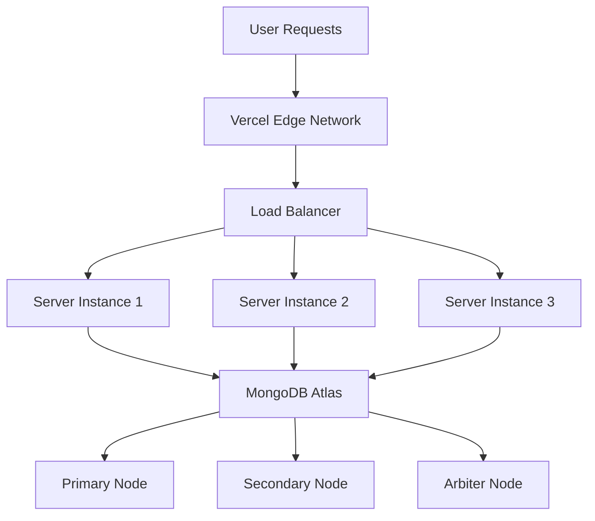

## 🔒 Security Architecture

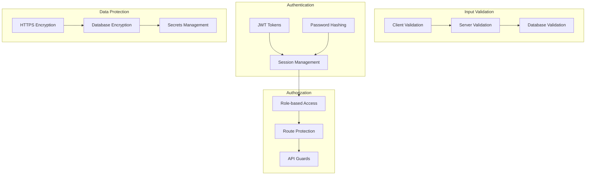

## 📱 Multi-Platform Architecture

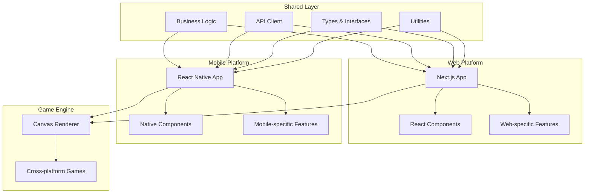

## 📈 Monitoring Architecture

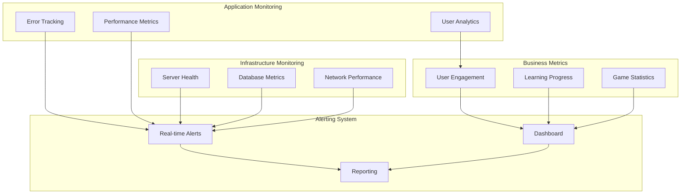

## 🚀 Deployment Architecture

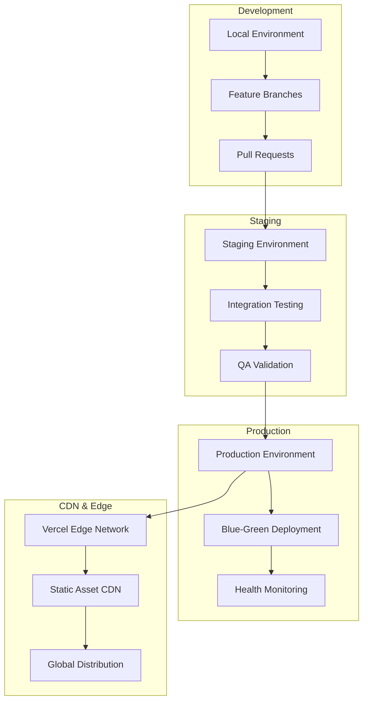

---

**Last Updated**: August 17, 2025
