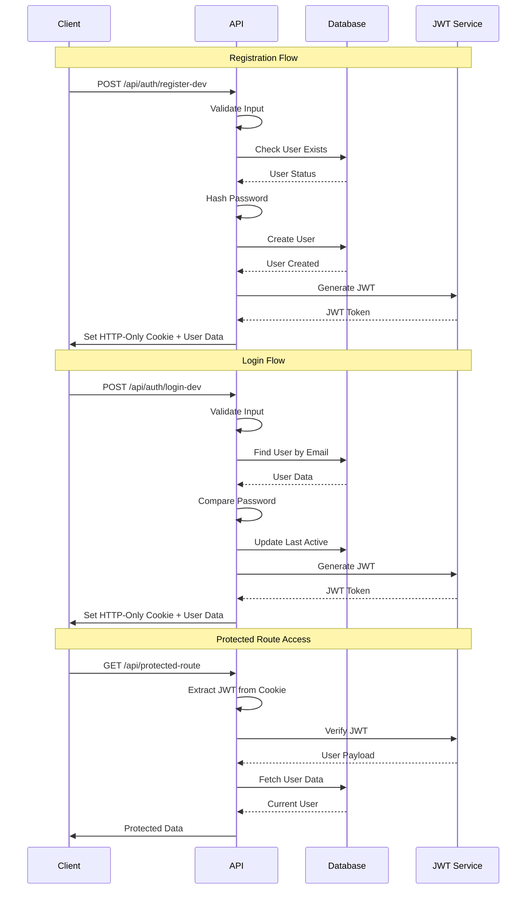
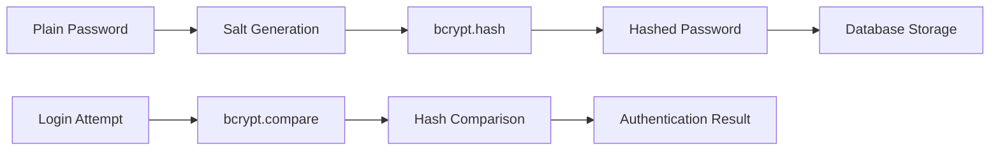
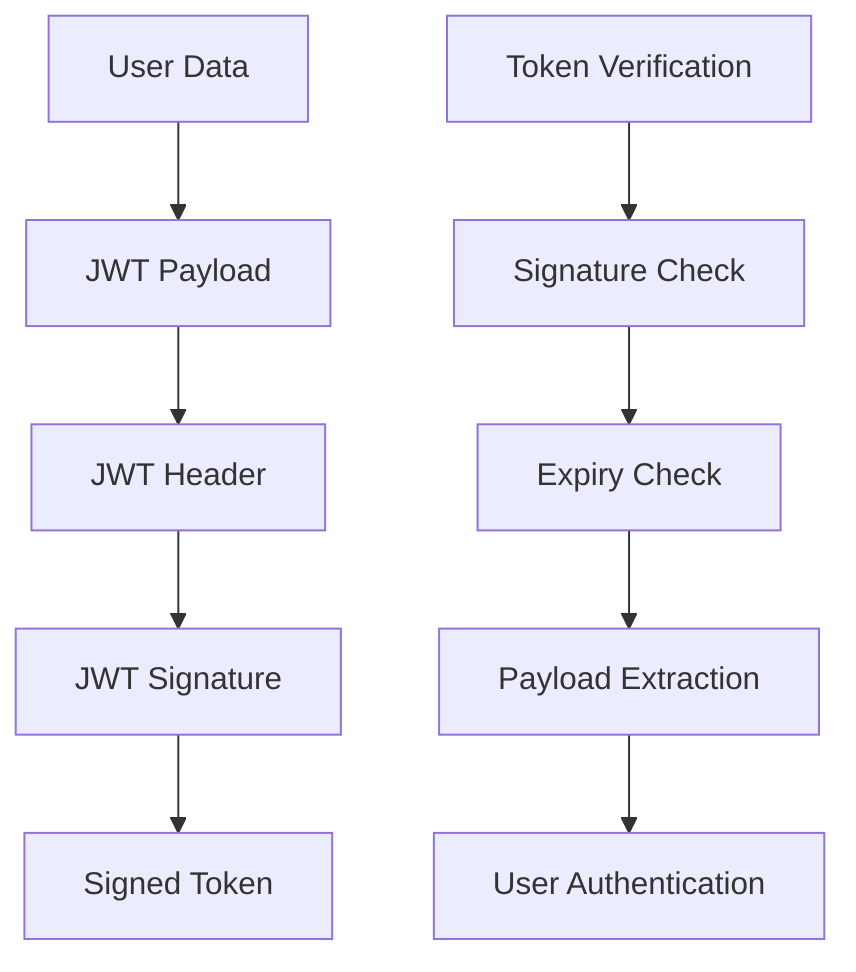

# Authentication System

This document details the complete authentication system implementation in CropSchool, including JWT-based authentication, user management, and security measures.

## 🔐 Authentication Overview

CropSchool uses a modern JWT-based authentication system with the following features:

- **JWT Tokens**: Stateless authentication
- **bcrypt Hashing**: Secure password storage
- **HTTP-Only Cookies**: Secure token storage
- **Role-Based Access**: Parent/child user roles
- **Database Integration**: MongoDB user management

## 🏗️ Authentication Flow



## 📁 File Structure

```
packages/web/src/
├── app/api/auth/
│   ├── login-dev/route.ts          # Development login endpoint
│   ├── register-dev/route.ts       # Development registration endpoint
│   ├── login/route.ts              # Production login endpoint
│   ├── register/route.ts           # Production registration endpoint
│   ├── me/route.ts                 # Get current user
│   └── logout/route.ts             # Logout endpoint
├── lib/auth/
│   ├── AuthContext.tsx             # React authentication context
│   ├── ProtectedRoute.tsx          # Route protection component
│   └── utils.ts                    # Authentication utilities
├── lib/db/
│   ├── mongodb.ts                  # Database connection
│   └── models/User.ts              # User model schema
└── middleware.ts                   # Route middleware
```

## 🛠️ Implementation Details

### JWT Token Generation

```typescript
// lib/auth/utils.ts
import jwt from 'jsonwebtoken';

export interface TokenPayload {
  userId: string;
  email: string;
  role: 'parent' | 'child';
}

export function generateToken(payload: TokenPayload): string {
  return jwt.sign(payload, process.env.JWT_SECRET!, {
    expiresIn: process.env.JWT_EXPIRES_IN || '24h',
    issuer: 'cropschool',
    audience: 'cropschool-users',
  });
}

export function verifyToken(token: string): TokenPayload {
  return jwt.verify(token, process.env.JWT_SECRET!) as TokenPayload;
}
```

### User Model Schema

```typescript
// lib/db/models/User.ts
import mongoose, { Document, Schema } from 'mongoose';
import bcrypt from 'bcryptjs';

export interface IUser extends Document {
  email: string;
  password: string;
  name: string;
  role: 'parent' | 'child';
  children?: mongoose.Types.ObjectId[];
  parent?: mongoose.Types.ObjectId;
  level?: number;
  points?: number;
  streakDays?: number;
  completedLessons?: string[];
  lastActive?: Date;
  createdAt: Date;
  updatedAt: Date;
  comparePassword(candidatePassword: string): Promise<boolean>;
}

const UserSchema = new Schema<IUser>(
  {
    email: {
      type: String,
      required: true,
      unique: true,
      lowercase: true,
      trim: true,
      validate: {
        validator: (email: string) => /^[^\s@]+@[^\s@]+\.[^\s@]+$/.test(email),
        message: 'Invalid email format',
      },
    },
    password: {
      type: String,
      required: true,
      minlength: 6,
    },
    name: {
      type: String,
      required: true,
      trim: true,
      maxlength: 100,
    },
    role: {
      type: String,
      enum: ['parent', 'child'],
      required: true,
      default: 'parent',
    },
    children: [
      {
        type: Schema.Types.ObjectId,
        ref: 'User',
      },
    ],
    parent: {
      type: Schema.Types.ObjectId,
      ref: 'User',
    },
    level: {
      type: Number,
      default: 1,
      min: 1,
      max: 100,
    },
    points: {
      type: Number,
      default: 0,
      min: 0,
    },
    streakDays: {
      type: Number,
      default: 0,
      min: 0,
    },
    completedLessons: [
      {
        type: String,
      },
    ],
    lastActive: {
      type: Date,
      default: Date.now,
    },
  },
  {
    timestamps: true,
  }
);

// Password hashing middleware
UserSchema.pre('save', async function (next) {
  if (!this.isModified('password')) return next();

  try {
    const salt = await bcrypt.genSalt(12);
    this.password = await bcrypt.hash(this.password, salt);
    next();
  } catch (error: any) {
    next(error);
  }
});

// Password comparison method
UserSchema.methods.comparePassword = async function (
  candidatePassword: string
) {
  return bcrypt.compare(candidatePassword, this.password);
};

export default mongoose.models.User ||
  mongoose.model<IUser>('User', UserSchema);
```

### Registration Endpoint

```typescript
// app/api/auth/register-dev/route.ts
import { NextResponse } from 'next/server';
import { connectDB } from '@/lib/db/mongodb';
import User from '@/lib/db/models/User';
import { generateToken } from '@/lib/auth/utils';

export async function POST(request: Request) {
  try {
    await connectDB();

    const { email, password, username } = await request.json();

    // Input validation
    if (!email || !password || !username) {
      return NextResponse.json(
        { error: 'All fields are required' },
        { status: 400 }
      );
    }

    if (password.length < 6) {
      return NextResponse.json(
        { error: 'Password must be at least 6 characters' },
        { status: 400 }
      );
    }

    // Check if user already exists
    const existingUser = await User.findOne({ email: email.toLowerCase() });
    if (existingUser) {
      return NextResponse.json(
        { error: 'User already exists' },
        { status: 400 }
      );
    }

    // Create new user (password auto-hashed by pre-save hook)
    const newUser = await User.create({
      email: email.toLowerCase(),
      password,
      name: username,
      role: 'parent',
      level: 1,
      points: 0,
      streakDays: 0,
      completedLessons: [],
      children: [],
    });

    // Generate JWT token
    const token = generateToken({
      userId: newUser._id.toString(),
      email: newUser.email,
      role: newUser.role,
    });

    // Prepare response data (exclude password)
    const userResponse = {
      id: newUser._id.toString(),
      email: newUser.email,
      name: newUser.name,
      role: newUser.role,
      level: newUser.level,
      points: newUser.points,
      streakDays: newUser.streakDays,
      children: newUser.children,
    };

    const response = NextResponse.json({
      user: userResponse,
      token,
    });

    // Set secure HTTP-only cookie
    response.cookies.set('auth-token', token, {
      httpOnly: true,
      secure: process.env.NODE_ENV === 'production',
      sameSite: 'lax',
      maxAge: 60 * 60 * 24 * 7, // 7 days
      path: '/',
    });

    return response;
  } catch (error) {
    console.error('Registration error:', error);
    return NextResponse.json(
      {
        error: 'Registration failed',
        details:
          process.env.NODE_ENV === 'development'
            ? (error as Error).message
            : undefined,
      },
      { status: 500 }
    );
  }
}
```

### Login Endpoint

```typescript
// app/api/auth/login-dev/route.ts
import { NextResponse } from 'next/server';
import { connectDB } from '@/lib/db/mongodb';
import User from '@/lib/db/models/User';
import { generateToken } from '@/lib/auth/utils';

export async function POST(request: Request) {
  try {
    await connectDB();

    const { email, password } = await request.json();

    // Input validation
    if (!email || !password) {
      return NextResponse.json(
        { error: 'Email and password are required' },
        { status: 400 }
      );
    }

    // Find user by email
    const user = await User.findOne({ email: email.toLowerCase() });
    if (!user) {
      return NextResponse.json(
        { error: 'Invalid credentials' },
        { status: 401 }
      );
    }

    // Verify password
    const isPasswordValid = await user.comparePassword(password);
    if (!isPasswordValid) {
      return NextResponse.json(
        { error: 'Invalid credentials' },
        { status: 401 }
      );
    }

    // Update last active timestamp
    user.lastActive = new Date();
    await user.save();

    // Generate JWT token
    const token = generateToken({
      userId: user._id.toString(),
      email: user.email,
      role: user.role,
    });

    // Prepare response data (exclude password)
    const userResponse = {
      id: user._id.toString(),
      email: user.email,
      name: user.name,
      role: user.role,
      level: user.level,
      points: user.points,
      streakDays: user.streakDays,
      children: user.role === 'parent' ? user.children : undefined,
    };

    const response = NextResponse.json({
      user: userResponse,
      token,
    });

    // Set secure HTTP-only cookie
    response.cookies.set('auth-token', token, {
      httpOnly: true,
      secure: process.env.NODE_ENV === 'production',
      sameSite: 'lax',
      maxAge: 60 * 60 * 24 * 7, // 7 days
      path: '/',
    });

    return response;
  } catch (error) {
    console.error('Login error:', error);
    return NextResponse.json(
      {
        error: 'Login failed',
        details:
          process.env.NODE_ENV === 'development'
            ? (error as Error).message
            : undefined,
      },
      { status: 500 }
    );
  }
}
```

## 🔒 Security Features

### Password Security



### JWT Security



### Security Best Practices

- **Password Hashing**: bcrypt with salt rounds of 12
- **JWT Expiration**: 24-hour token lifetime
- **HTTP-Only Cookies**: Prevent XSS attacks
- **HTTPS Only**: Secure token transmission
- **Input Validation**: Server-side validation
- **Rate Limiting**: Prevent brute force attacks
- **CORS Configuration**: Restricted origins

## 🛡️ Route Protection

### Protected Route Component

```typescript
// lib/auth/ProtectedRoute.tsx
'use client';

import React, { useEffect, useState } from 'react';
import { useRouter } from 'next/navigation';
import { useAuth } from './AuthContext';

interface ProtectedRouteProps {
  children: React.ReactNode;
  requiredRole?: 'parent' | 'child';
  redirectTo?: string;
}

export default function ProtectedRoute({
  children,
  requiredRole,
  redirectTo = '/login'
}: ProtectedRouteProps) {
  const { user, isLoading } = useAuth();
  const router = useRouter();
  const [isAuthorized, setIsAuthorized] = useState(false);

  useEffect(() => {
    if (isLoading) return;

    if (!user) {
      router.push(redirectTo);
      return;
    }

    if (requiredRole && user.role !== requiredRole) {
      router.push('/unauthorized');
      return;
    }

    setIsAuthorized(true);
  }, [user, isLoading, requiredRole, router, redirectTo]);

  if (isLoading) {
    return (
      <div className="flex items-center justify-center min-h-screen">
        <div className="animate-spin rounded-full h-12 w-12 border-b-2 border-blue-600"></div>
      </div>
    );
  }

  if (!isAuthorized) {
    return null;
  }

  return <>{children}</>;
}
```

### Middleware Protection

```typescript
// middleware.ts
import { NextResponse } from 'next/server';
import type { NextRequest } from 'next/server';
import { verifyToken } from '@/lib/auth/utils';

export function middleware(request: NextRequest) {
  const token = request.cookies.get('auth-token')?.value;
  const isAuthPage =
    request.nextUrl.pathname.startsWith('/login') ||
    request.nextUrl.pathname.startsWith('/register');
  const isProtectedPage = request.nextUrl.pathname.startsWith('/dashboard');

  // Redirect authenticated users away from auth pages
  if (token && isAuthPage) {
    try {
      verifyToken(token);
      return NextResponse.redirect(new URL('/dashboard', request.url));
    } catch {
      // Invalid token, continue to auth page
    }
  }

  // Protect dashboard routes
  if (isProtectedPage && !token) {
    return NextResponse.redirect(new URL('/login', request.url));
  }

  if (isProtectedPage && token) {
    try {
      verifyToken(token);
    } catch {
      // Invalid token, redirect to login
      const response = NextResponse.redirect(new URL('/login', request.url));
      response.cookies.delete('auth-token');
      return response;
    }
  }

  return NextResponse.next();
}

export const config = {
  matcher: ['/dashboard/:path*', '/login', '/register'],
};
```

## 📱 Client-Side Integration

### Auth Context Provider

```typescript
// lib/auth/AuthContext.tsx
'use client';

import React, { createContext, useContext, useEffect, useState } from 'react';

interface User {
  id: string;
  email: string;
  name: string;
  role: 'parent' | 'child';
  level: number;
  points: number;
  streakDays: number;
  children?: string[];
}

interface AuthContextType {
  user: User | null;
  isLoading: boolean;
  login: (email: string, password: string) => Promise<void>;
  register: (email: string, password: string, username: string) => Promise<void>;
  logout: () => Promise<void>;
}

const AuthContext = createContext<AuthContextType | undefined>(undefined);

export function AuthProvider({ children }: { children: React.ReactNode }) {
  const [user, setUser] = useState<User | null>(null);
  const [isLoading, setIsLoading] = useState(true);

  // Check for existing authentication on mount
  useEffect(() => {
    checkAuth();
  }, []);

  const checkAuth = async () => {
    try {
      const response = await fetch('/api/auth/me');
      if (response.ok) {
        const userData = await response.json();
        setUser(userData);
      }
    } catch (error) {
      console.error('Auth check failed:', error);
    } finally {
      setIsLoading(false);
    }
  };

  const login = async (email: string, password: string) => {
    const response = await fetch('/api/auth/login-dev', {
      method: 'POST',
      headers: { 'Content-Type': 'application/json' },
      body: JSON.stringify({ email, password })
    });

    if (!response.ok) {
      const error = await response.json();
      throw new Error(error.error || 'Login failed');
    }

    const { user: userData } = await response.json();
    setUser(userData);
  };

  const register = async (email: string, password: string, username: string) => {
    const response = await fetch('/api/auth/register-dev', {
      method: 'POST',
      headers: { 'Content-Type': 'application/json' },
      body: JSON.stringify({ email, password, username })
    });

    if (!response.ok) {
      const error = await response.json();
      throw new Error(error.error || 'Registration failed');
    }

    const { user: userData } = await response.json();
    setUser(userData);
  };

  const logout = async () => {
    await fetch('/api/auth/logout', { method: 'POST' });
    setUser(null);
  };

  return (
    <AuthContext.Provider value={{ user, isLoading, login, register, logout }}>
      {children}
    </AuthContext.Provider>
  );
}

export const useAuth = () => {
  const context = useContext(AuthContext);
  if (context === undefined) {
    throw new Error('useAuth must be used within an AuthProvider');
  }
  return context;
};
```

## 🧪 Testing Authentication

### Test Cases

1. **Registration Tests**
   - Valid registration
   - Duplicate email handling
   - Invalid input validation
   - Password strength requirements

2. **Login Tests**
   - Valid credentials
   - Invalid credentials
   - Non-existent user
   - Locked account scenarios

3. **JWT Tests**
   - Token generation
   - Token verification
   - Token expiration
   - Invalid token handling

4. **Route Protection Tests**
   - Protected route access
   - Unauthorized access attempts
   - Role-based restrictions
   - Middleware functionality

### Example Test

```typescript
// __tests__/auth.test.ts
import { POST } from '@/app/api/auth/login-dev/route';

describe('Authentication API', () => {
  test('should login with valid credentials', async () => {
    const request = new Request('http://localhost:3000/api/auth/login-dev', {
      method: 'POST',
      body: JSON.stringify({
        email: 'test@example.com',
        password: 'password123',
      }),
    });

    const response = await POST(request);
    const data = await response.json();

    expect(response.status).toBe(200);
    expect(data.user).toBeDefined();
    expect(data.token).toBeDefined();
    expect(data.user.email).toBe('test@example.com');
  });

  test('should reject invalid credentials', async () => {
    const request = new Request('http://localhost:3000/api/auth/login-dev', {
      method: 'POST',
      body: JSON.stringify({
        email: 'test@example.com',
        password: 'wrongpassword',
      }),
    });

    const response = await POST(request);
    const data = await response.json();

    expect(response.status).toBe(401);
    expect(data.error).toBe('Invalid credentials');
  });
});
```

## 🔧 Environment Configuration

```bash
# .env.local
JWT_SECRET=your-super-secret-jwt-key-change-this-in-production
JWT_EXPIRES_IN=24h
MONGODB_URI=mongodb://localhost:27017/cropschool
NODE_ENV=development
```

## 📈 Monitoring & Analytics

### Authentication Metrics

- Login success/failure rates
- Registration conversion rates
- Token expiration patterns
- Security event logging
- User session duration

### Security Monitoring

- Failed login attempts
- Suspicious activity detection
- Token theft detection
- Brute force protection
- Account lockout mechanisms

---

**Last Updated**: August 17, 2025
