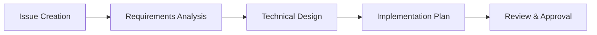
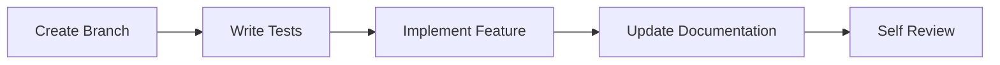
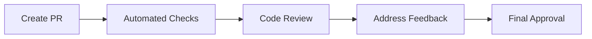
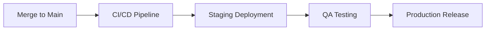

# Contributing to CropSchool

Thank you for your interest in contributing to CropSchool! This guide will help you get started with contributing to our educational gaming platform.

## 🤝 Code of Conduct

By participating in this project, you agree to abide by our Code of Conduct:

- **Be respectful**: Treat everyone with respect and kindness
- **Be inclusive**: Welcome newcomers and help them learn
- **Be collaborative**: Work together towards common goals
- **Be constructive**: Provide helpful feedback and suggestions
- **Be patient**: Remember that everyone is learning

## 🚀 Getting Started

### Prerequisites

- Node.js 18+ and npm
- MongoDB (for local development)
- Git
- VS Code (recommended)

### Setup Development Environment

```bash
# 1. Fork and clone the repository
git clone https://github.com/YOUR-USERNAME/cropschool.git
cd cropschool

# 2. Install dependencies
npm install

# 3. Set up environment variables
cp .env.example .env.local
# Edit .env.local with your settings

# 4. Start MongoDB
mongod --dbpath /usr/local/var/mongodb

# 5. Start development server
npm run dev:web
```

### Project Structure

```
cropschool/
├── packages/
│   ├── web/                # Next.js web application
│   ├── mobile/             # React Native mobile app
│   ├── game-engine/        # Educational game engine
│   ├── ui/                 # Shared UI components
│   └── shared/             # Common utilities
├── docs/                   # Documentation
├── .github/                # GitHub workflows
└── package.json            # Monorepo configuration
```

## 📝 How to Contribute

### Types of Contributions

#### 🐛 Bug Reports

- Use the bug report template
- Include steps to reproduce
- Provide system information
- Add screenshots if applicable

#### ✨ Feature Requests

- Use the feature request template
- Explain the problem you're solving
- Describe your proposed solution
- Consider implementation complexity

#### 🔧 Code Contributions

- Fix bugs
- Implement new features
- Improve performance
- Enhance documentation
- Add tests

#### 📚 Documentation

- Improve existing docs
- Add missing documentation
- Fix typos and grammar
- Create tutorials and guides

## 🔄 Development Workflow

### 1. Create an Issue

Before starting work, create an issue to discuss:

- What you plan to implement
- How you plan to implement it
- Any questions or concerns

### 2. Fork and Branch

```bash
# Fork the repository on GitHub
# Clone your fork
git clone https://github.com/YOUR-USERNAME/cropschool.git

# Create a feature branch
git checkout -b feature/your-feature-name
```

### 3. Make Changes

```bash
# Make your changes
# Test your changes
npm test

# Lint your code
npm run lint

# Format your code
npm run format

# Type check
npm run type-check
```

### 4. Commit Changes

We use [Conventional Commits](https://www.conventionalcommits.org/):

```bash
# Good commit messages
git commit -m "feat: add user authentication system"
git commit -m "fix: resolve login form validation issue"
git commit -m "docs: update API documentation"
git commit -m "test: add unit tests for auth service"
git commit -m "refactor: improve game engine performance"

# Commit message format
type(scope): description

# Types:
# feat: new feature
# fix: bug fix
# docs: documentation
# test: adding tests
# refactor: code refactoring
# style: formatting changes
# perf: performance improvements
# ci: CI/CD changes
# build: build system changes
```

### 5. Push and Create PR

```bash
# Push your branch
git push origin feature/your-feature-name

# Create a Pull Request on GitHub
# Use the PR template
# Link to related issues
```

## 🧪 Testing Guidelines

### Running Tests

```bash
# Run all tests
npm test

# Run tests for specific package
npm test --workspace=@cropschool/web

# Run tests in watch mode
npm run test:watch

# Run tests with coverage
npm run test:coverage

# Run E2E tests
npm run test:e2e
```

### Writing Tests

#### Unit Tests

```typescript
// Example: __tests__/auth.test.ts
import { validateEmail } from '../src/utils/validation';

describe('Email Validation', () => {
  test('should validate correct email format', () => {
    expect(validateEmail('user@example.com')).toBe(true);
  });

  test('should reject invalid email format', () => {
    expect(validateEmail('invalid-email')).toBe(false);
  });
});
```

#### Component Tests

```typescript
// Example: __tests__/Button.test.tsx
import { render, screen } from '@testing-library/react';
import { Button } from '../src/components/Button';

describe('Button Component', () => {
  test('renders button with text', () => {
    render(<Button>Click me</Button>);
    expect(screen.getByText('Click me')).toBeInTheDocument();
  });

  test('calls onClick handler when clicked', () => {
    const handleClick = jest.fn();
    render(<Button onClick={handleClick}>Click me</Button>);

    screen.getByText('Click me').click();
    expect(handleClick).toHaveBeenCalledTimes(1);
  });
});
```

#### API Tests

```typescript
// Example: __tests__/api/auth.test.ts
import { POST } from '../src/app/api/auth/login/route';

describe('Login API', () => {
  test('should login with valid credentials', async () => {
    const request = new Request('http://localhost:3000/api/auth/login', {
      method: 'POST',
      body: JSON.stringify({
        email: 'test@example.com',
        password: 'password123',
      }),
    });

    const response = await POST(request);
    const data = await response.json();

    expect(response.status).toBe(200);
    expect(data.user).toBeDefined();
    expect(data.token).toBeDefined();
  });
});
```

### Test Coverage Requirements

- **Unit Tests**: 80% minimum coverage
- **Integration Tests**: Critical user flows
- **E2E Tests**: Main user journeys
- **Component Tests**: All UI components

## 📋 Code Style Guide

### TypeScript

```typescript
// Use explicit types
interface User {
  id: string;
  email: string;
  name: string;
  role: 'parent' | 'child';
}

// Use type guards
function isUser(obj: any): obj is User {
  return obj && typeof obj.id === 'string' && typeof obj.email === 'string';
}

// Use proper error handling
async function fetchUser(id: string): Promise<User> {
  try {
    const response = await fetch(`/api/users/${id}`);
    if (!response.ok) {
      throw new Error(`Failed to fetch user: ${response.statusText}`);
    }
    return await response.json();
  } catch (error) {
    console.error('Error fetching user:', error);
    throw error;
  }
}
```

### React Components

```typescript
// Use functional components with TypeScript
interface ButtonProps {
  children: React.ReactNode;
  variant?: 'primary' | 'secondary';
  size?: 'sm' | 'md' | 'lg';
  onClick?: () => void;
  disabled?: boolean;
}

export function Button({
  children,
  variant = 'primary',
  size = 'md',
  onClick,
  disabled = false
}: ButtonProps) {
  return (
    <button
      className={`btn btn-${variant} btn-${size}`}
      onClick={onClick}
      disabled={disabled}
      type="button"
    >
      {children}
    </button>
  );
}
```

### CSS/Tailwind

```css
/* Use semantic class names */
.game-container {
  @apply flex flex-col items-center justify-center min-h-screen bg-gradient-to-b from-blue-100 to-green-100;
}

.game-board {
  @apply grid grid-cols-3 gap-4 p-6 bg-white rounded-lg shadow-lg;
}

/* Use CSS custom properties for themes */
:root {
  --color-primary: #3b82f6;
  --color-secondary: #10b981;
  --color-success: #22c55e;
  --color-warning: #f59e0b;
  --color-error: #ef4444;
}
```

## 📚 Documentation Standards

### Code Documentation

```typescript
/**
 * Calculates the user's game score based on performance metrics
 * @param correctAnswers - Number of correct answers
 * @param totalQuestions - Total number of questions
 * @param timeSpent - Time spent in seconds
 * @param hintsUsed - Number of hints used
 * @returns The calculated score (0-100)
 */
export function calculateScore(
  correctAnswers: number,
  totalQuestions: number,
  timeSpent: number,
  hintsUsed: number
): number {
  const accuracy = correctAnswers / totalQuestions;
  const timeBonus = Math.max(0, 1 - timeSpent / 600); // Bonus for completing within 10 minutes
  const hintPenalty = hintsUsed * 0.05; // 5% penalty per hint

  return Math.round((accuracy + timeBonus - hintPenalty) * 100);
}
```

### README Requirements

Each package should have a README.md with:

- Purpose and description
- Installation instructions
- Usage examples
- API documentation
- Contributing guidelines

### Commit Message Guidelines

```bash
# Format: type(scope): description
#
# Types:
# feat: new feature
# fix: bug fix
# docs: documentation only changes
# style: changes that do not affect the meaning of the code
# refactor: code change that neither fixes a bug nor adds a feature
# perf: code change that improves performance
# test: adding missing tests or correcting existing tests
# build: changes that affect the build system or external dependencies
# ci: changes to CI configuration files and scripts

# Examples:
feat(auth): implement JWT-based authentication
fix(game-engine): resolve canvas rendering issue on mobile
docs(api): add authentication endpoint documentation
test(ui): add unit tests for Button component
refactor(database): optimize user query performance
```

## 🎯 Feature Development Process

### 1. Planning Phase



### 2. Implementation Phase



### 3. Review Phase



### 4. Deployment Phase



## 🐛 Bug Fix Process

### 1. Bug Report

- Reproduce the issue
- Identify root cause
- Create fix plan
- Estimate impact

### 2. Fix Implementation

```bash
# Create hotfix branch for critical bugs
git checkout -b hotfix/critical-auth-bug

# For regular bugs, use feature branch
git checkout -b fix/user-profile-display
```

### 3. Testing

- Write regression tests
- Test in multiple environments
- Verify fix doesn't break other features

### 4. Documentation

- Update relevant documentation
- Add troubleshooting guides
- Document lessons learned

## 🎮 Game Development Guidelines

### Adding New Games

1. **Game Design Document**
   - Learning objectives
   - Gameplay mechanics
   - Visual design
   - Audio requirements

2. **Implementation Structure**

```typescript
// games/MyNewGame.ts
export class MyNewGame extends BaseGame {
  constructor(config: GameConfig) {
    super(config);
    this.setupGame();
  }

  setupGame(): void {
    // Initialize game state
  }

  update(deltaTime: number): void {
    // Game logic updates
  }

  render(): void {
    // Rendering logic
  }

  handleInput(input: InputEvent): void {
    // Input handling
  }
}
```

3. **Educational Content**
   - Age-appropriate content
   - Curriculum alignment
   - Progressive difficulty
   - Clear feedback

4. **Accessibility**
   - Keyboard navigation
   - Screen reader support
   - High contrast mode
   - Large touch targets

## 📱 Mobile Development

### React Native Guidelines

```typescript
// Use platform-specific code when needed
import { Platform } from 'react-native';

const styles = StyleSheet.create({
  container: {
    flex: 1,
    paddingTop: Platform.OS === 'ios' ? 20 : 0,
  },
});

// Use responsive design
import { Dimensions } from 'react-native';

const { width, height } = Dimensions.get('window');
const isTablet = width > 768;
```

### Testing on Devices

```bash
# iOS
npm run ios

# Android
npm run android

# Expo Go
npm start
```

## 🔍 Code Review Checklist

### Functionality

- [ ] Code works as expected
- [ ] Edge cases are handled
- [ ] Error handling is implemented
- [ ] Performance is acceptable

### Code Quality

- [ ] Follows coding standards
- [ ] Is well-documented
- [ ] Has appropriate tests
- [ ] Avoids code duplication

### Security

- [ ] Input validation is present
- [ ] No sensitive data exposure
- [ ] Authentication/authorization checks
- [ ] SQL injection prevention

### Accessibility

- [ ] Keyboard navigation works
- [ ] Screen reader compatible
- [ ] Color contrast compliance
- [ ] Focus management

### Mobile Compatibility

- [ ] Responsive design
- [ ] Touch-friendly interface
- [ ] Performance on mobile devices
- [ ] Battery usage consideration

## 🚀 Release Process

### Version Numbering

We follow [Semantic Versioning](https://semver.org/):

- **MAJOR**: Breaking changes
- **MINOR**: New features (backward compatible)
- **PATCH**: Bug fixes (backward compatible)

### Release Checklist

- [ ] All tests pass
- [ ] Documentation updated
- [ ] Version numbers updated
- [ ] Changelog updated
- [ ] Security review completed
- [ ] Performance testing done
- [ ] Backup plan ready

## 📞 Getting Help

### Discord Community

Join our Discord server for:

- Real-time discussions
- Technical support
- Feature planning
- Community events

### GitHub Discussions

Use GitHub Discussions for:

- Feature requests
- Technical questions
- Best practices
- Project roadmap

### Issue Templates

Use our issue templates for:

- Bug reports
- Feature requests
- Documentation improvements
- Security vulnerabilities

## 🏆 Recognition

### Contributor Rewards

- **First-time contributors**: Welcome package
- **Regular contributors**: Special recognition
- **Major contributors**: Project maintainer status
- **Outstanding contributions**: Featured in newsletter

### Hall of Fame

Contributors are recognized in:

- Project README
- Release notes
- Annual contributor report
- Conference presentations

## 📊 Metrics and Goals

### Code Quality Metrics

- Test coverage > 80%
- Build success rate > 95%
- Code review response time < 24 hours
- Bug fix time < 48 hours

### Community Metrics

- Response time to issues < 48 hours
- PR review time < 72 hours
- Documentation completeness > 90%
- User satisfaction > 4.5/5

---

Thank you for contributing to CropSchool! Together, we're building an amazing educational platform for children worldwide. 🌱📚🎮

**Last Updated**: August 17, 2025
