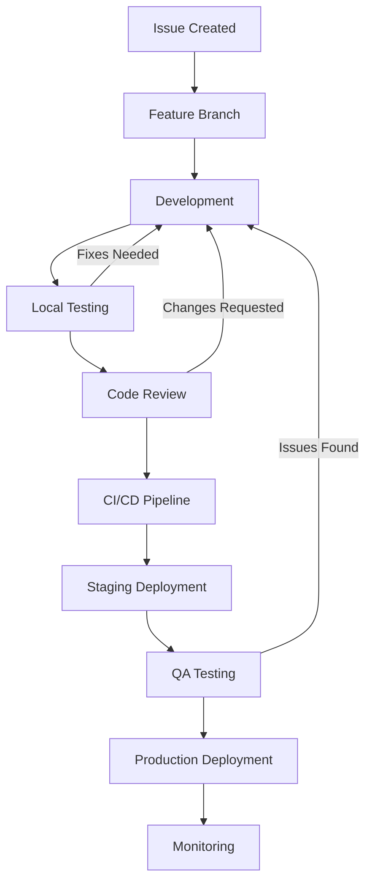
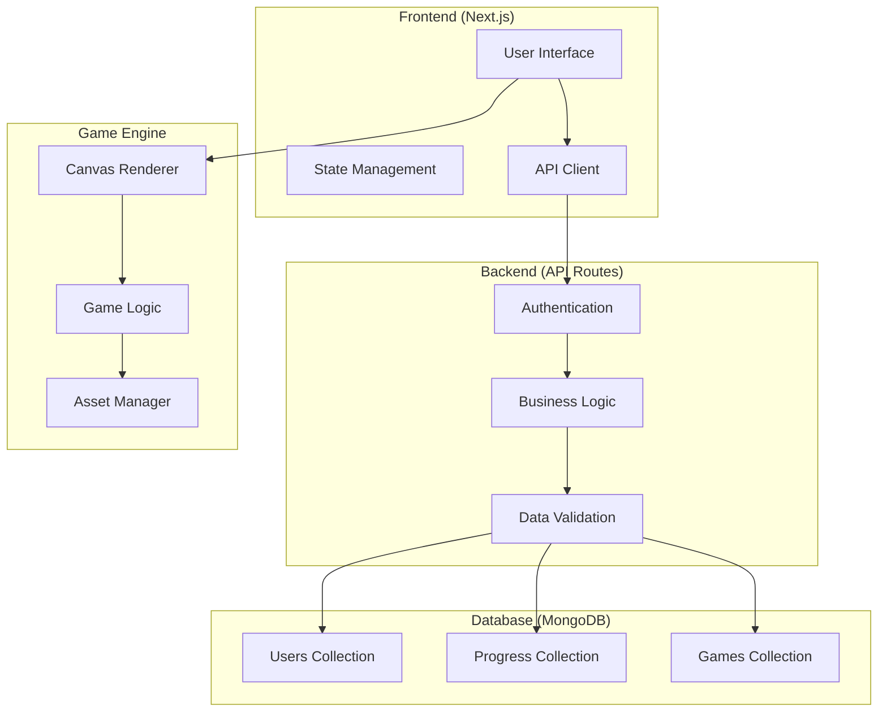
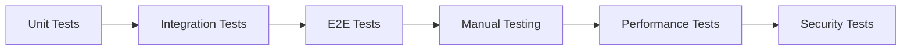
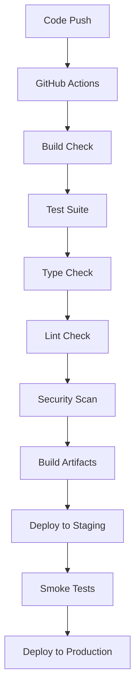
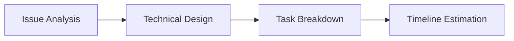
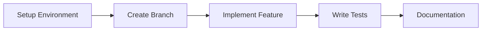
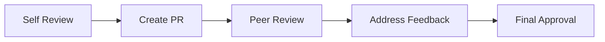
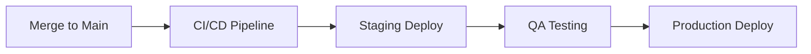

# Development Workflow

This document outlines the complete development workflow for CropSchool, including daily development processes, code review, and deployment procedures.

## 🔄 Development Lifecycle



## 🚀 Quick Start Workflow

### 1. Environment Setup

```bash
# Clone the repository
git clone https://github.com/hotelChaitanya/cropschool.git
cd cropschool

# Install dependencies
npm install

# Copy environment file
cp .env.example .env.local

# Start MongoDB
mongod --dbpath /usr/local/var/mongodb

# Start development server
npm run dev:web
```

### 2. Daily Development Process

#### Creating a New Feature

```bash
# Create feature branch
git checkout -b feature/user-authentication
git push -u origin feature/user-authentication

# Make changes...
# Test locally...

# Commit changes
git add .
git commit -m "feat: implement user authentication system"
git push origin feature/user-authentication
```

#### Code Review Process

```bash
# Create pull request
gh pr create --title "feat: implement user authentication" --body "Implements JWT-based authentication system"

# Address review comments
git add .
git commit -m "fix: address PR review comments"
git push origin feature/user-authentication

# Merge after approval
gh pr merge --squash
```

## 🏗️ Architecture Workflow



## 🔧 Development Commands

### Monorepo Commands

```bash
# Install all dependencies
npm install

# Run web development server
npm run dev:web

# Run mobile development server
npm run dev:mobile

# Run UI component storybook
npm run dev:ui

# Build all packages
npm run build

# Run all tests
npm test

# Lint all packages
npm run lint

# Type check all packages
npm run type-check
```

### Package-Specific Commands

```bash
# Web package
cd packages/web
npm run dev          # Start development server
npm run build        # Build for production
npm run start        # Start production server

# Mobile package
cd packages/mobile
npm run start        # Start Expo development server
npm run android      # Run on Android
npm run ios          # Run on iOS

# Game Engine package
cd packages/game-engine
npm run dev          # Start development with hot reload
npm run build        # Build library
npm run demo         # Run demo games

# UI package
cd packages/ui
npm run storybook    # Start Storybook
npm run build        # Build component library
npm test             # Run component tests
```

## 🧪 Testing Workflow



### Testing Strategy

```bash
# Run all tests
npm test

# Run tests in watch mode
npm run test:watch

# Run tests with coverage
npm run test:coverage

# Run specific package tests
npm test --workspace=@cropschool/web

# Run E2E tests
npm run test:e2e
```

## 📦 Build & Deploy Workflow



### Deployment Commands

```bash
# Build for production
npm run build

# Deploy web app (Vercel)
vercel deploy

# Deploy mobile app (Expo)
cd packages/mobile
expo build:android
expo build:ios
```

## 🔍 Code Quality Workflow

### Pre-commit Hooks

```bash
# Husky hooks automatically run:
# 1. ESLint check
# 2. Prettier formatting
# 3. TypeScript compilation
# 4. Unit tests

# Manual quality checks
npm run lint
npm run format
npm run type-check
```

### Code Review Checklist

- [ ] **Functionality**: Does the code work as expected?
- [ ] **Tests**: Are there adequate tests covering the changes?
- [ ] **Performance**: Are there any performance implications?
- [ ] **Security**: Are there any security vulnerabilities?
- [ ] **Accessibility**: Does the UI meet accessibility standards?
- [ ] **Documentation**: Is the code well-documented?
- [ ] **Standards**: Does it follow our coding standards?

## 🌟 Feature Development Workflow

### 1. Planning Phase



### 2. Development Phase



### 3. Review Phase



### 4. Deployment Phase



## 🚨 Emergency Hotfix Workflow

```bash
# Create hotfix branch from main
git checkout main
git pull origin main
git checkout -b hotfix/critical-bug-fix

# Make minimal changes
# Test thoroughly
# Commit and push
git add .
git commit -m "fix: resolve critical authentication bug"
git push origin hotfix/critical-bug-fix

# Create emergency PR
gh pr create --title "HOTFIX: Critical bug fix" --body "Emergency fix for production issue"

# Fast-track review and merge
# Deploy immediately after merge
```

## 📊 Workflow Metrics

### Key Performance Indicators

- **Development Velocity**: Features completed per sprint
- **Code Quality**: Test coverage, linting compliance
- **Deployment Frequency**: How often we deploy to production
- **Lead Time**: Time from issue creation to production
- **Mean Time to Recovery**: How quickly we fix issues

### Monitoring Tools

- **GitHub Actions**: CI/CD pipeline status
- **Vercel**: Deployment and performance metrics
- **MongoDB Atlas**: Database performance
- **Sentry**: Error tracking and monitoring

## 🔧 Troubleshooting Common Issues

### Development Environment

```bash
# Clear npm cache
npm cache clean --force

# Reinstall dependencies
rm -rf node_modules package-lock.json
npm install

# Reset Next.js cache
rm -rf .next

# Reset TypeScript cache
rm -rf tsconfig.tsbuildinfo
```

### Database Issues

```bash
# Restart MongoDB
mongod --dbpath /usr/local/var/mongodb

# Check MongoDB connection
mongo
> db.runCommand({ ping: 1 })

# Reset test database
npm run db:reset
```

### Build Issues

```bash
# Clear build cache
npm run clean

# Check TypeScript errors
npm run type-check

# Check linting errors
npm run lint
```

---

**Last Updated**: August 17, 2025
