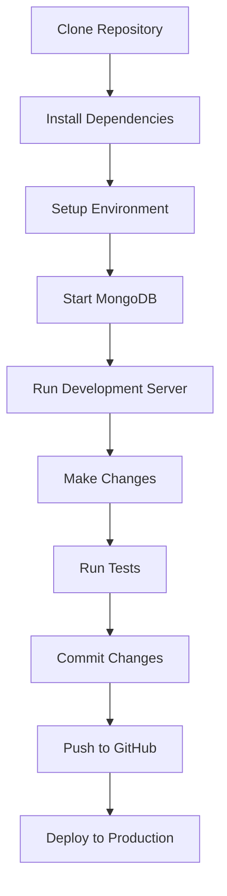

# CropSchool Wiki

Welcome to the **CropSchool** wiki! This comprehensive documentation covers everything you need to know about developing, deploying, and maintaining the CropSchool educational gaming platform.

## 📚 Quick Navigation

### Getting Started

- [**Setup Guide**](./SETUP.md) - Complete development environment setup
- [**Development Workflow**](./DEVELOPMENT-WORKFLOW.md) - Day-to-day development process
- [**Contributing Guide**](./CONTRIBUTING.md) - How to contribute to the project

### Architecture & Design

- [**System Architecture**](./ARCHITECTURE.md) - High-level system overview
- [**Database Schema**](./DATABASE.md) - MongoDB collections and relationships
- [**API Documentation**](./API.md) - REST API endpoints and usage
- [**Authentication Flow**](./AUTHENTICATION.md) - User authentication system

### Development

- [**Monorepo Structure**](./MONOREPO.md) - Package organization and dependencies
- [**Coding Standards**](./CODING-STANDARDS.md) - Code style and best practices
- [**Testing Strategy**](./TESTING.md) - Testing approach and guidelines
- [**Deployment Guide**](./DEPLOYMENT.md) - Production deployment process

### Features

- [**Game Engine**](./GAME-ENGINE.md) - Educational game development
- [**Web Application**](./WEB-APP.md) - Next.js frontend features
- [**Mobile App**](./MOBILE-APP.md) - React Native mobile features
- [**UI Components**](./UI-COMPONENTS.md) - Shared component library

### Operations

- [**Monitoring & Logging**](./MONITORING.md) - Application monitoring
- [**Performance Optimization**](./PERFORMANCE.md) - Performance best practices
- [**Security Guidelines**](./SECURITY.md) - Security implementation
- [**Troubleshooting**](./TROUBLESHOOTING.md) - Common issues and solutions

## 🚀 Technology Stack

| Layer            | Technology                   | Purpose                    |
| ---------------- | ---------------------------- | -------------------------- |
| Frontend         | Next.js 14, React 18         | Web application framework  |
| Mobile           | React Native, Expo           | Cross-platform mobile app  |
| Backend          | Node.js, Next.js API Routes  | Server-side API            |
| Database         | MongoDB, Mongoose            | Document database          |
| Authentication   | JWT, bcrypt                  | User authentication        |
| Game Engine      | TypeScript, Canvas API       | Educational game rendering |
| UI Library       | React, Tailwind CSS          | Component library          |
| State Management | Redux Toolkit                | Application state          |
| Build Tools      | TypeScript, ESLint, Prettier | Development tools          |
| Testing          | Jest, Vitest                 | Testing framework          |
| Deployment       | Vercel, MongoDB Atlas        | Cloud deployment           |

## 🏗️ Project Structure

```
cropschool/
├── docs/                          # Documentation (this wiki)
├── packages/
│   ├── web/                       # Next.js web application
│   ├── mobile/                    # React Native mobile app
│   ├── game-engine/               # Educational game engine
│   ├── ui/                        # Shared UI component library
│   ├── shared/                    # Common utilities and types
│   └── api/                       # Backend API (future)
├── .github/                       # GitHub workflows and templates
├── docker-compose.yml             # Development environment
└── package.json                   # Monorepo configuration
```

## 🔄 Development Workflow Overview



## 📊 Key Metrics

- **Packages**: 5 (web, mobile, game-engine, ui, shared)
- **Components**: 50+ reusable UI components
- **API Endpoints**: 15+ REST endpoints
- **Database Collections**: 6 (users, progress, achievements, etc.)
- **Game Types**: Math, Science, Language Arts
- **Supported Platforms**: Web, iOS, Android

## 🤝 Contributing

We welcome contributions! Please read our [Contributing Guide](./CONTRIBUTING.md) for details on:

- Code of conduct
- Development process
- Submitting pull requests
- Reporting issues

## 📄 License

This project is licensed under the MIT License - see the [LICENSE](../LICENSE) file for details.

## 📞 Support

- **Issues**: [GitHub Issues](https://github.com/hotelChaitanya/cropschool/issues)
- **Discussions**: [GitHub Discussions](https://github.com/hotelChaitanya/cropschool/discussions)
- **Email**: support@cropschool.com

---

**Last Updated**: August 17, 2025
**Version**: 1.0.0
